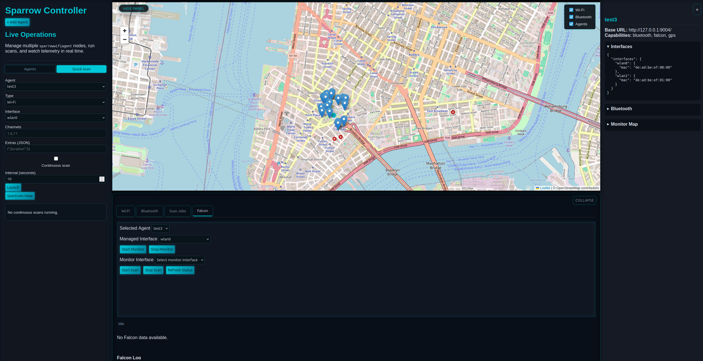
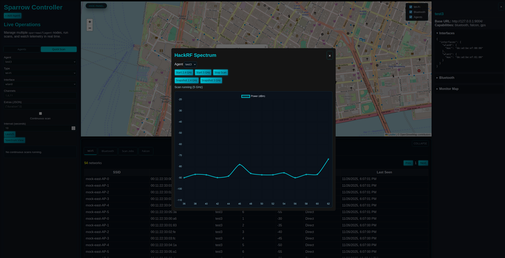

# Sparrow Multi-Agent Controller (Proof of Concept)

This directory contains an HTTP controller that aggregates multiple `sparrowwifiagent` instances, proxies scan commands, and stores their responses in SQLite.  The intent is to keep all remote agents untouched and provide a single place to trigger Wi-Fi/Falcon/Bluetooth scans and visualize their results via a simple web UI.

## Features
- Register remote agents (hostname/IP, port, descriptive metadata, reported capabilities)
- Trigger scans (basic Wi-Fi, Falcon advanced, Bluetooth discovery) against one or more agents
- Persist raw responses in SQLite for table/map rendering and historical queries
- Provide REST endpoints plus a WebSocket stream for the JavaScript front end
- Leaflet-based map that aggregates Wi-Fi/Falcon observations (plus Bluetooth devices) from every agent in real time
- Falcon monitor-mode controls (start/stop monitor mode, start/stop scans, view live status/polling indicator)
- Optional continuous scans per agent/interface with controller-managed scheduling
- Bluetooth results tab with live map markers plus per-agent Falcon panels for networks/clients and inline actions (deauth/capture)
- Spectrum/HackRF modal that can launch 2.4 GHz/5 GHz sweeps or snapshots from the browser
- Leave hooks that can later forward the aggregated data into Elastic
- Optional ingest endpoint so agents can push Wi‑Fi/Falcon/Bluetooth results directly into the controller (pull remains available)

## Running the controller
```bash
cd controller
python3 -m venv .venv
source .venv/bin/activate
pip install -r requirements.txt
uvicorn app.main:app --reload
```

The service stores its SQLite database in `controller/state/controller.db` by default.  Set `CONTROLLER_DB_URL` to override (e.g., point to PostgreSQL) and `CONTROLLER_ELASTIC_URL` once you are ready to forward events to Elastic.

## Development notes
- The API is documented through the built-in FastAPI schema.  Once uvicorn is running, browse to `http://localhost:8000/docs`.
- The placeholder UI lives in `controller/frontend` and is served statically from `/`.
- Future exporter hooks can subscribe to the internal event bus located in `app/events.py`.

## Architecture overview

The controller is a fairly small FastAPI service.  Each registered agent row stores:

- Base URL + API key (if supplied) used by `AgentClient`
- Cached interface metadata (`agent.interfaces`) and monitor map (`agent.monitor_map`)
- Reported capabilities (wifi/falcon/bluetooth), GPS snapshot, and free-form description

Every 30 seconds the UI refreshes `/api/agents` to keep the interface list, monitor map, and capability badges in sync with what agents report over `/wireless/interfaces`.  The WebSocket `/ws/scans` is used for incremental scan updates so the table/map refresh without a full page reload.

## Falcon workflow

1. Choose an agent in the “Selected Agent” dropdown.  The detail drawer loads `/api/agents/<id>`, `/status`, and (if a Falcon scan is running) `/falcon/<id>/scan/results` so the tab shows the last snapshot without rerunning a scan.
2. Enter the managed interface (e.g., `wlan0`) and click **Start Monitor**.  The controller forwards the call to `/falcon/startmonmode/<iface>` and caches the returned alias (typically `wlan0mon`).  The dropdowns are updated immediately and a warning prevents stopping monitor mode while Falcon scans are still running.
3. Select the monitor alias in the **Monitor Interface** dropdown and click **Start Scan**.  The UI kicks off `/falcon/<id>/scan/start` and enters auto-poll mode: results refresh every 5 seconds while the scan is running.  A “Auto-refreshing results…” badge appears at the top of the Falcon panel so it is obvious when polling is active.
4. Click **Stop Scan** to call `/falcon/<id>/scan/stop`.  Polling ceases, the buttons re-enable, and the monitor stop button becomes available again.  The controller also re-fetches `/api/agents` to keep the monitor map synchronized.

The Falcon log (console in the bottom of the tab) records every REST call the UI makes to simplify troubleshooting.  Each entry includes the agent ID, interface, and raw JSON response from the agent so discrepancies can be diagnosed quickly.

## Spectrum / HackRF controls

Open the **Spectrum** modal (top right button) to manage HackRF sweeps remotely:

1. Pick an agent that has a HackRF connected from the dropdown.
2. Click **Start 2.4 GHz** or **Start 5 GHz** to launch a continuous sweep via `/spectrum/<id>/start?band=24|5`.  The controller now hits the legacy agent endpoints (`/spectrum/scanstart24`, `/scanstart5`, `/scanstop`, `/scanstatus`) so both Ubertooth and HackRF agents behave as expected.
3. While a sweep is running the chart polls `/spectrum/<id>/channels` every 2 seconds and draws the reported power buckets.  Use **Stop Scan** to halt the sweep, or **Snapshot** buttons to capture a single sweep without leaving a long-running process on the agent.

The X-axis intentionally mirrors whatever the agent returns (which can be raw Hz buckets or Wi‑Fi channels) so you can correlate with the textual data returned by `/spectrum/scanstatus`.  For finer resolution adjust `self.binWidth`, `minFreq`, and `maxFreq` in `sparrowhackrf.py` at the agent.

Note: The spectrum modal is currently geared toward HackRF responses. Ubertooth 2.4 GHz specan data is not rendered in the chart yet even though the legacy endpoints are called.

## Screenshots






## Documentation for Falcon controls

- Use the **Falcon Monitor & Scan Control** section to toggle monitor mode per agent and start/stop dedicated Falcon scans.
- Monitor-mode commands simply forward to the agent's `/falcon/startmonmode` and `/falcon/stopmonmode` endpoints; supply the managed interface (e.g., `wlan0`) when entering monitor mode and the resulting monitor interface (typically `wlan0mon`) when launching scans.
- The **Refresh Status** button queries `/falcon/scanrunning/<iface>` for the selected agent and interface and appends the response to the Falcon log pane.
- Polling only occurs when a scan is confirmed to be running; deleting an agent or receiving a 404 automatically tears down the poller to avoid hammering offline devices.

## Outstanding issues / TODO

1. **Monitor map persistence:** The “Monitor Map” JSON panel in the detail drawer still reflects whatever aliases the agent last reported.  If an agent fails to remove `wlan0mon` from its `/wireless/interfaces` payload we will show a stale alias after refresh.  We should teach the controller to prune aliases whose monitor interface disappears.
2. **Falcon alias tracking with multiple interfaces:** We currently track one `monitor_map` per managed interface, but richer UI cues would help when an agent has multiple radios.  Consider showing both managed and alias names in the dropdown so operators can see which pairings exist.
3. **Spectrum axis formatting:** The X-axis now mirrors raw agent keys; we should revisit a GHz-normalized plot once we have consistent frequency values (possibly by normalizing on the agent before sending channel data).
4. **UI hint for lingering Falcon results:** When a Falcon scan is stopped the tab continues to show the last snapshot (by design).  Adding a timestamp or badge noting “Last update at …” would make it obvious when the data is stale.
5. **Agent deletion safety:** Deleting an agent with continuous scans still requires manual cleanup on the agent side.  Long term we should teach the controller to call `/scans/continuous/stop` whenever an agent row disappears.

## Mock agents for testing
You can spin up mock agents that simulate Wi-Fi, Falcon, and Bluetooth data so the controller can be exercised without any radios.

```
cd controller
source .venv/bin/activate
python tests/mock_agent.py --name mock-east --port 9001 --lat 40.7128 --lon -74.0060
# In another terminal:
python tests/mock_agent.py --name mock-west --port 9002 --lat 34.0522 --lon -118.2437
```

With the controller running, register each mock agent via the UI (URL `http://localhost:9001`, etc.) or run the automated workflow script:

```
python tests/demo_workflow.py --controller http://localhost:8000 \\
    --agent mock-east http://localhost:9001 \\
    --agent mock-west http://localhost:9002
```

The script registers each agent, toggles monitor mode on `wlan0`, and launches both Wi-Fi and Falcon scans so that the dashboard receives live map data and WebSocket events.
